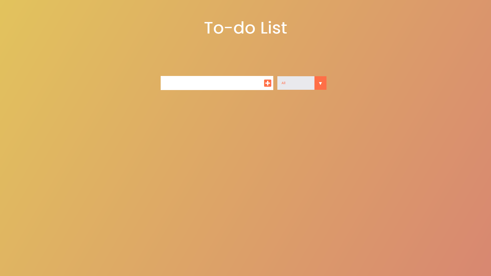

<h1 align="center" style="font-weight: bold;">TO-DO LIST</h1>

    <b>Project Description:</b>

A simple and intuitive to-do list application built with HTML, CSS, and JavaScript. This project allows users to add, remove, and manage their tasks efficiently, providing a clean and responsive interface. The app showcases basic DOM manipulation, event handling, and styling techniques. Additionally, it enables users to save their tasks using LocalStorage, allowing the data to persist in the user's browser even after the page is refreshed or closed, ensuring a seamless and continuous experience.

This site was created as part of the course "The Creative JavaScript Course" with the goal of applying and enhancing new skills and techniques in HTML5 and CSS3.

     <a href="https://guithr.github.io/todo-list/">📱 Visit this Project</a>

<h2 id="layout"> Previews</h2>

    

<h2 id="technologies">💻 Technologies</h2>

- CSS3
- HTML5
- JAVASCRIPT